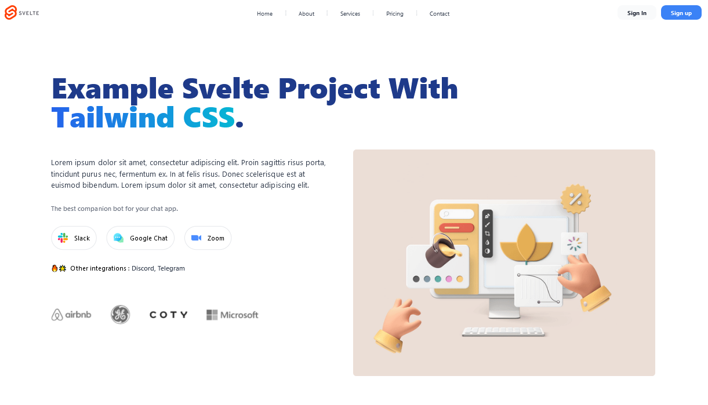

# Svelte Landing Page Template



This is an example of a Svelte + Tailwind CSS landing page project

## Clone & Run Project
```sh
git clone https://github.com/fitri-hy/svelte-landing-page.git
```
```sh
cd svelte-landing-page
```
```sh
npm install
```
```sh
npm run dev

## Building Project
```sh
npm run build
```

Follow me: <a href="https://hy-tech.my.id/">FOLLOW</a>
